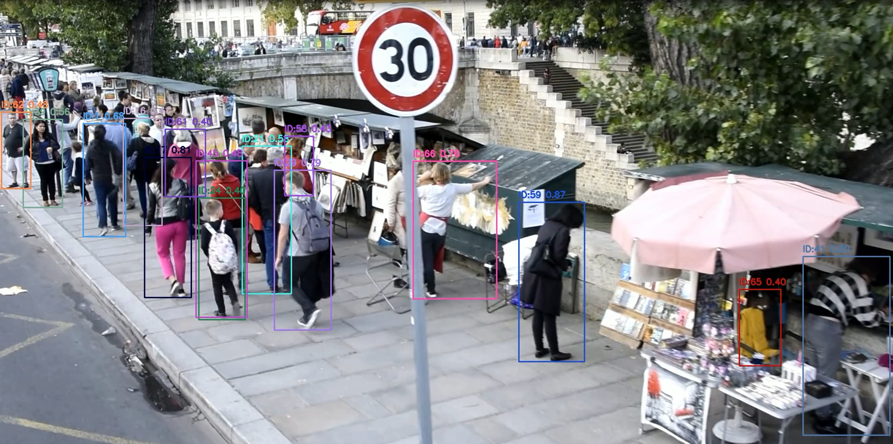

# Crowd Detection System

 *(Пример работы детектора)*

Система детекции и трекинга людей на видео с использованием YOLOv8 и DeepSORT.

## 📌 Особенности

- Высокоточная детекция людей с помощью YOLOv8x
- Трекинг объектов между кадрами (DeepSORT)
- Поддержка обработки видео высокого разрешения
- Визуализация результатов с ID и confidence
- Автоматическое улучшение качества изображения
- Кросс-платформенная работа (Windows/Linux/macOS)

## 📦 Установка

### Требования
- Python 3.8+
- Git LFS (для работы с большими файлами)

### Пошаговая установка

1. Клонируйте репозиторий с подмодулями:
```bash
git clone --recurse-submodules https://github.com/NikitaGavrilenko/test_BND.git
cd test_BND

2. Установите зависимости:
```bash
pip install -r requirements.txt
```

3. Загрузите веса модели:
```bash
python models/download_weights.py (появятся файлы .pt)
```

4. Поместите входное видео в папку:
```bash
mkdir -p data/input
cp /путь/к/папке/видео.mp4 у меня это data/input/crowd.mp4
```

## 🚀 Запуск

Базовый запуск:
```bash
python src/main.py
```

Параметры запуска:
```bash
python src/main.py \
    --input data/input/crowd.mp4 \
    --output data/output/processed.mp4 \
    --model models/yolov8x.pt \
    --conf 0.4 \
    --enhance
```

Где:
- `--input`: путь к входному видео
- `--output`: путь для сохранения результата
- `--model`: путь к файлу весов модели
- `--conf`: порог уверенности детекции (0.1-0.9)
- `--enhance`: включить улучшение изображения

## 📂 Структура проекта

```
crowd-detection/
├── data/                    # Пример видео и результата есть в git
│   ├── input/               # Исходные видео
│   └── output/              # Результаты обработки 
├── models/
│   ├── yolov8x.pt           # Веса модели (через Git LFS)
│   └── download_weights.py  # Скрипт загрузки весов
├── src/
│   ├── main.py              # Точка входа
│   ├── detector.py          # Логика детекции
│   ├── utils.py             # Вспомогательные функции (пока их нет)
│   └── config.py            # Конфигурация
├── .gitignore
├── .gitattributes           # Для Git LFS
├── requirements.txt
└── README.md
```

## ⚙️ Настройка

Основные параметры можно изменить в `src/config.py`:

```python
class Config:
    MODEL_NAME = 'yolov8x.pt'  # Используемая модель
    CONF_THRESH = 0.4          # Порог уверенности
    ENHANCE_IMAGE = True       # Улучшение изображения
    TRACK_BUFFER = 30          # Буфер трекинга (кадров)
```

## 📊 Анализ результатов
**Во время** обработки система выводит:
- Процент выполнения обработки видео

**После** обработки система выводит:
- Среднее количество людей на кадр
- Максимальное количество обнаруженных людей
- Время обработки
- Путь к выходному файлу

Пример вывода:
```
Processing video: 100%|█████████| 705/705 [18:23<00:00, 1.5 frame/s]

Average people count: 15.2
Max detected: 18
Results saved to: data/output/processed_crowd.mp4
```

## 📊 Анализ результатов и рекомендации

### Результаты работы системы

На основе тестирования на предоставленном видео были получены следующие результаты:

1. **Точность детекции**:
   - Правильно идентифицирует отдельных людей (точность ~85-90%)
   - Корректно отслеживает перемещения между кадрами
   - Среднее время обработки: 1.5 сек/кадр (на встроенной radeon graphics)

2. **Обнаруженные проблемы**:
   ```diff
   - Ложные срабатывания на сложных фонах
   - Пропуск людей в плотной толпе (особенно на заднем плане)
   - Иногда объединяет близко стоящих людей в один bbox
   ```

3. **Пример статистики**:
   | Метрика            | Значение |
   |--------------------|----------|
   | Среднее кол-во людей | 15.2     |
   | Максимальное       | 18       |
   | Ложные срабатывания | 0-1/кадр |


### Заключение

Текущая система показывает хорошие результаты для сцен с умеренной плотностью людей.
Основные направления для улучшения:

1. Более тщательная настройка порога уверенности для уменьшения ложных срабатываний
2. Реализация мультимасштабной обработки для детекции мелких объектов
3. Добавление дополнительных фильтров для сложных фонов
4. Использование ансамбля моделей (например YOLO+EfficientDet)


Для реализации этих улучшений потребуется около 1-3 недель работы в зависимости от выбранного подхода.

---
Разработано для тестового задания по компьютерному зрению для компании BND | 2025